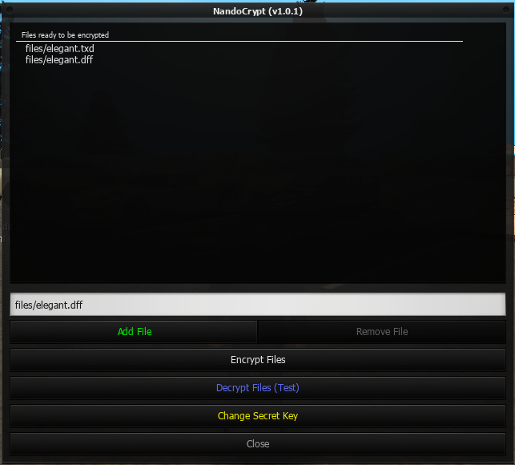
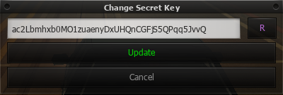

## About

MTA Forums topic: [Link](https://forum.mtasa.com/topic/134836-rel-nandocrypt-file-encryption-resource/)

MTA Discord discussion thread: [Channel Link](https://discord.com/channels/278474088903606273/955219814358597642/955220504422273095)

Star ⭐ this repository if you like it!

Contact: Nando#7736 (Discord)

This MTA resource lets you encrypt any files using a secret key (string) that is stored inside a script that it generates & compiles. You use the script it creates to decrypt the files in your own resource(s).

It uses `aes128` ([Advanced Encryption Standard](https://en.wikipedia.org/wiki/Advanced_Encryption_Standard) in CTR mode) with 16 characters long keys.

### Pros

1. Makes no calls to the server for decrypting the files clientside.
2. Decrypter script is compiled using [MTA's Luac](https://forum.mtasa.com/topic/67224-luacmtasacom-and-us/), you can't uncompile it.
3. Decrypter script is not sent to the client's cache, so you can only steal it if you have access to the server's files. But even if you obtain it, see point number 3.
4. It would take many years to test all possible secret key combinations to decrypt any files encrypted with this resource.

### Cons

1. Decrypting files clientside likely impacts script performance a bit, but it's the price to pay. However, Aes128 is the fastest encryption method available natively in MTA, so you should get very satisfying results.

## Setup

1. Create empty file named `nando_decrypter` inside [nando_crypt](/nando_crypt)
2. Use `start nando_crypt` to initiate the resource
3. Use `/nandocrypt` to open the panel

## Use

1. Generate or pick a **secret key** using the panel.
This string of characters will be used to encrypt and decrypt your files.

2. Encrypt a file stored in the server using the panel.
A new file will be created using the prefix defined (e.g. `elegant.dff.nandocrypt`).
A `nando_decrypter` script file will be created, as well as `nando_decrypter_keys.json` which stores the necessary keys used in nando_decrypter to decrypt your files alongside the secret key stored in it.

3. Test decryption of that file using the panel.
Enter the file name without the custom extension and it will try to decrypt it using the decrypter file generated (*which can be used both clientside and serverside*).

4. Copy `nando_decrypter` file generated to your own unique resource and use it to decrypt the files you just encrypted in your own way.
Keep `nando_decrypter_keys.json` in the `nando_crypt` resource because it is used by the ecrypter to generate the `nando_decrypter` script.

5. Check [nando_crypt-example](/nando_crypt-example) to understand how this can be achieved.

## Advice

- If working on a project with multiple people or a shared repository, don't share the secret key used to encrypt the files.
- **Sorry** if the instructions seem a bit confusing at first! I think that if you experiment with the resource you will get used to it.

## Related Projects

- [mta-mod-downloader](https://github.com/Fernando-A-Rocha/mta-mod-downloader#readme) & [mta-auto-modloader](https://github.com/Fernando-A-Rocha/mta-auto-modloader#readme): mod downloader systems which support **NandoCrypt**
- [mta-add-models](https://github.com/Fernando-A-Rocha/mta-add-models#readme): a library for adding new models (vehicles, skins, etc) to your server which supports **NandoCrypt**

## Acknowledgements

- [Patrick](https://forum.mtasa.com/profile/43688-patrick/) - Creator of [pCrypt](https://mtaclub.eu/pcrypt) - main inspiration for this project & helped me resolve some issues!
